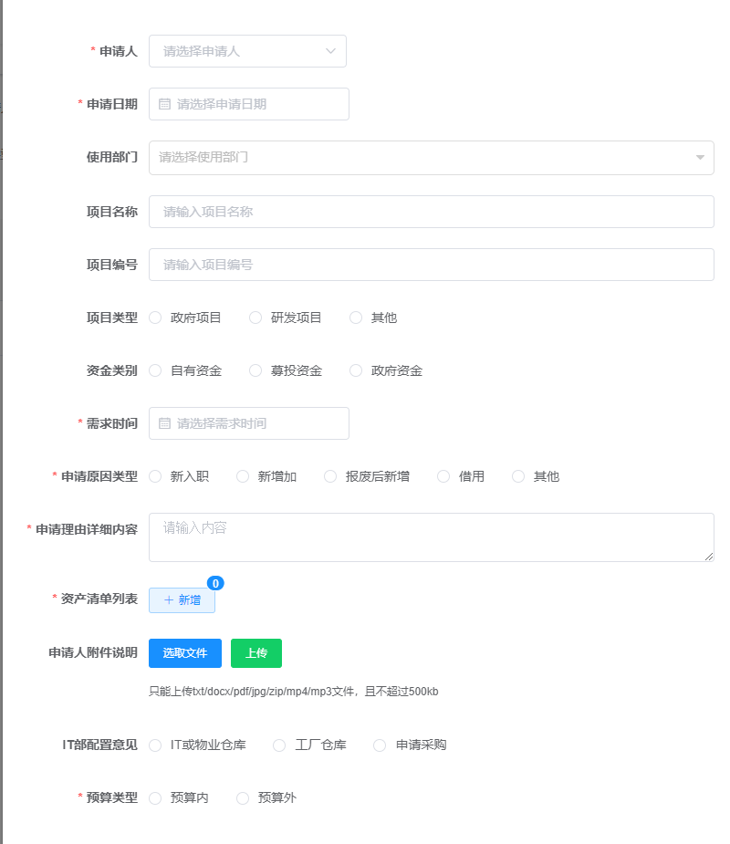
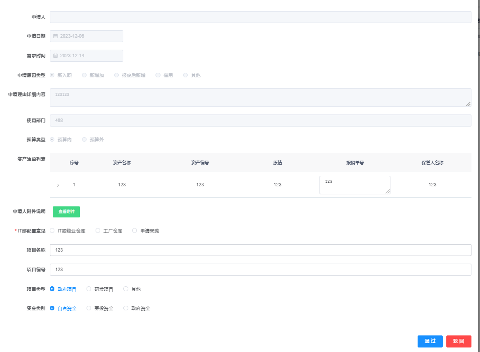

```text
   本系统是个人参照若依框架定制化开发的一个简单OA演示案例->固资申请
   【当然可以在此基础上再拓展，本人只是做一下记录而已】
   需要自行修改 mysql，sqlserver，redis，minio，rocketmq密码
   开发环境在application-dev.yml
   生产环境在application-prod.yml 
```
###部分图例
申请表单

附件预览

审批清单



### 前端

```
# 克隆项目
git clone

# 进入项目目录
cd laotabu-ui

# 安装依赖
npm install

# 建议不要直接使用 cnpm 安装依赖，会有各种诡异的 bug。可以通过如下操作解决 npm 下载速度慢的问题
npm install --registry=https://registry.npmmirror.com

# 启动服务
npm run dev

# 构建测试环境
npm run build:stage

# 构建生产环境
npm run build:prod
```


